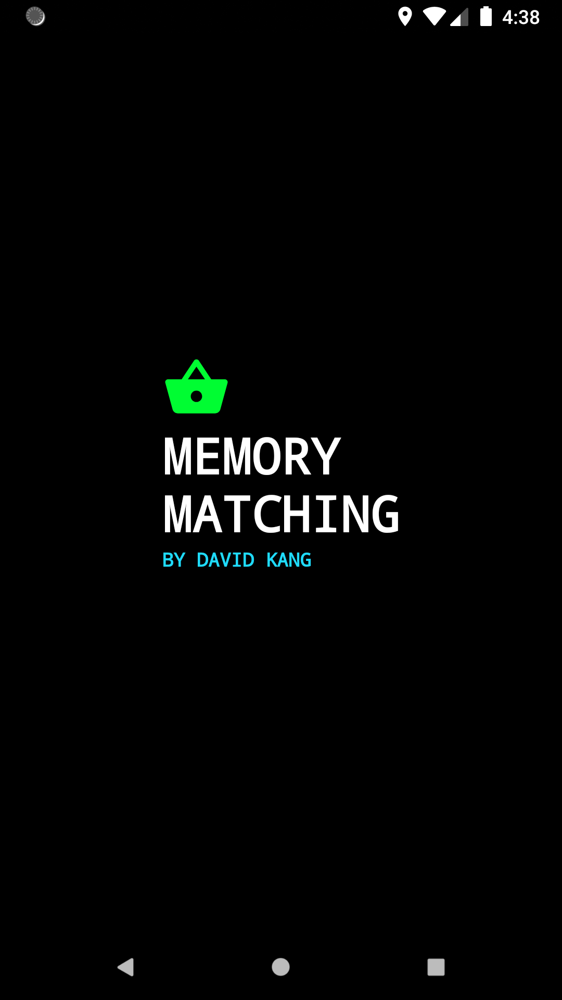
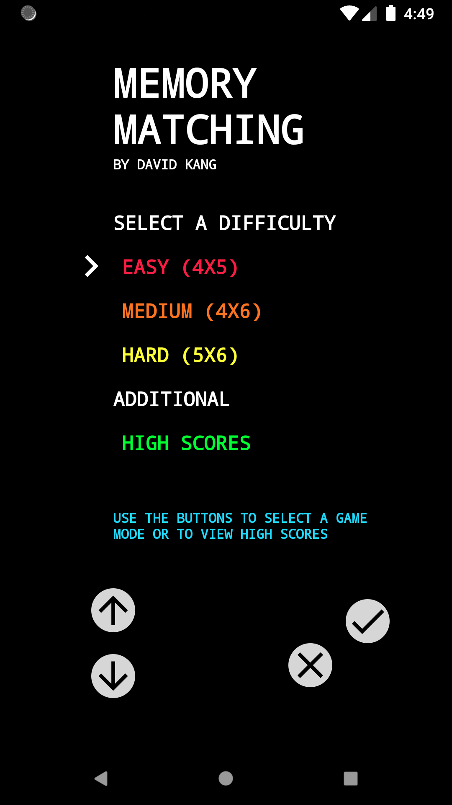
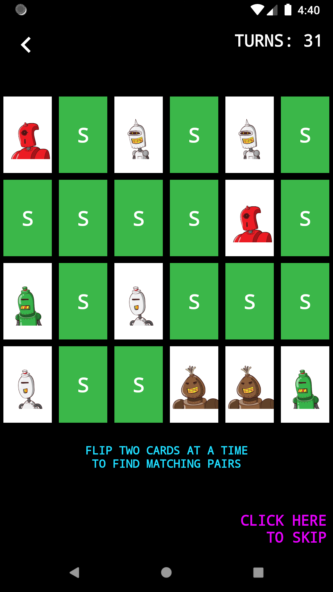
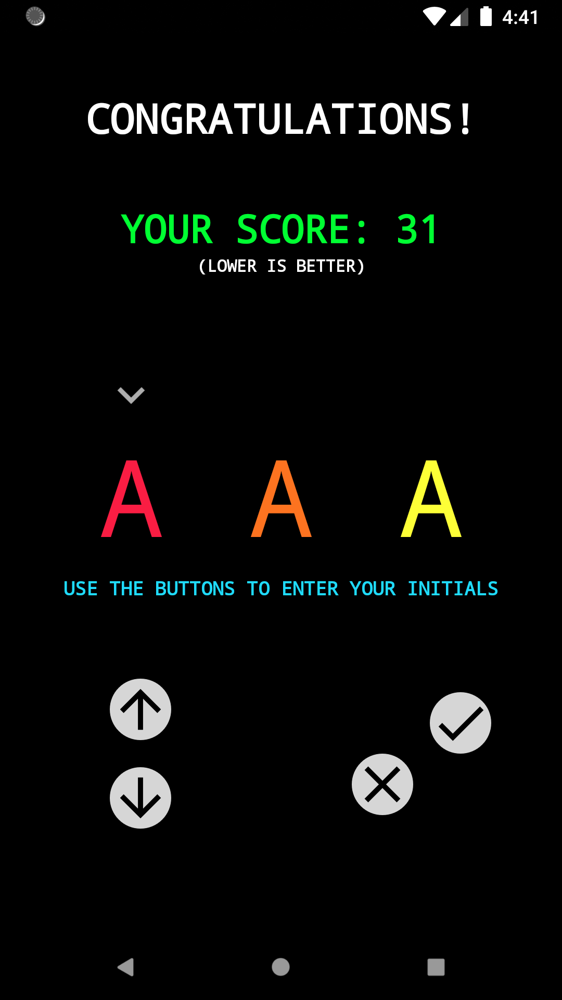
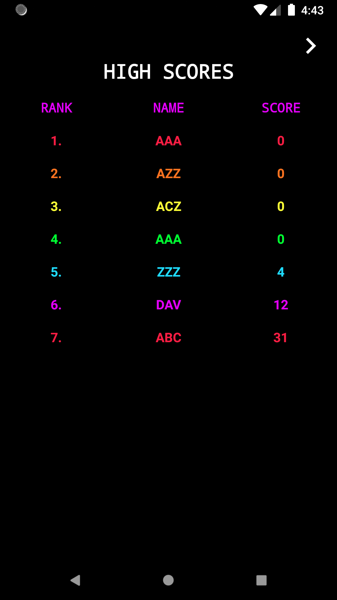

# MemoryMatchingGame

Mobile Challenge Submission for Shopify application.

Theme of application is arcade.

### External libraries used:

I prioritized using vanilla Kotlin, but based on time decided to use these libraries a bit to speed up development.

- `RxAndroid` / `RxJava2`
- `Picasso`
- `OkHttp3`
- `Gson`
- `Room persistance library`

### This project contains 5 main screens:

1. Splash Screen
2. Home Screen
3. Game Screen
4. Enter High Score Screen
5. High Scores Screen

---

### Splash Screen

This is a basic splash screen, on launch.

---

### Home Screen

The user can select a difficulty level in the menu or look at the high scores.
The up and down arrow buttons are used for navigation, and the checkmark button can be used to select the choice.

---

### Game Screen

The user can select two cards at the time by tapping on the cards.  The application will keep track of how many turns the user has used. 
The number of turns is used to keep score, where lower number of turns is better.

A user has the choice to skip the gameplay to view the rest of the app since this is not an actual game and it may take some time to finish a game.

To be consistent with the rest of the application, I could later implement this screen to use buttons to select cards when flipping them over. 

---

### Enter High Score Screen

A user can use the buttons to create a three letter initial for their high score.

---

### High Scores Screen 

The user can view all the high scores that were made in the game.  A lower score is better since it indicates that they used less turns.

